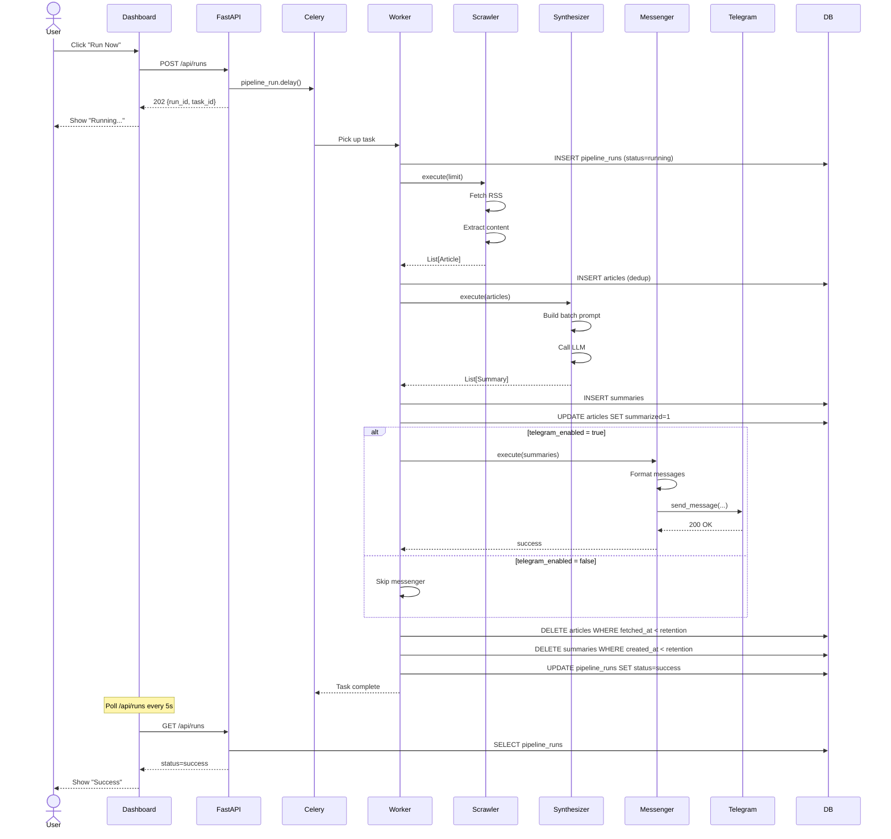
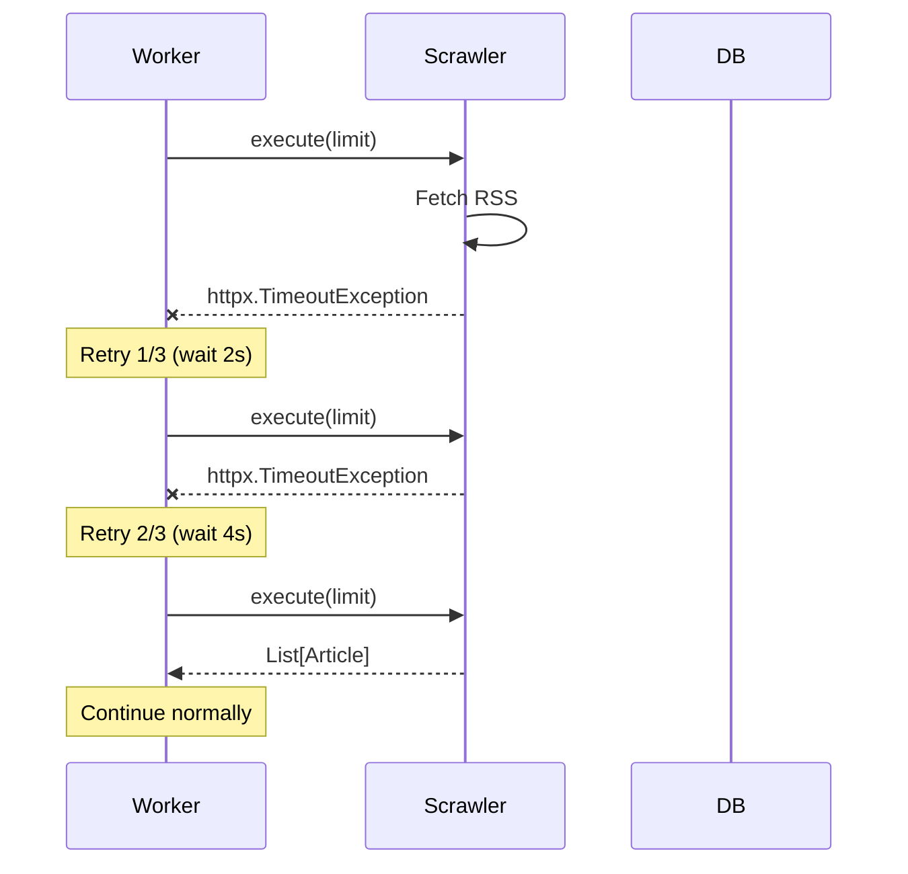
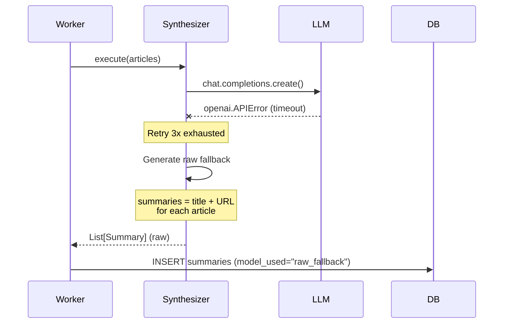
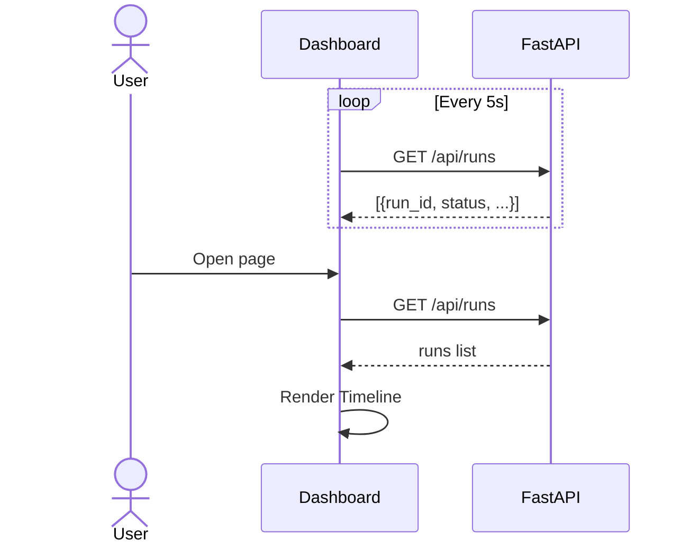
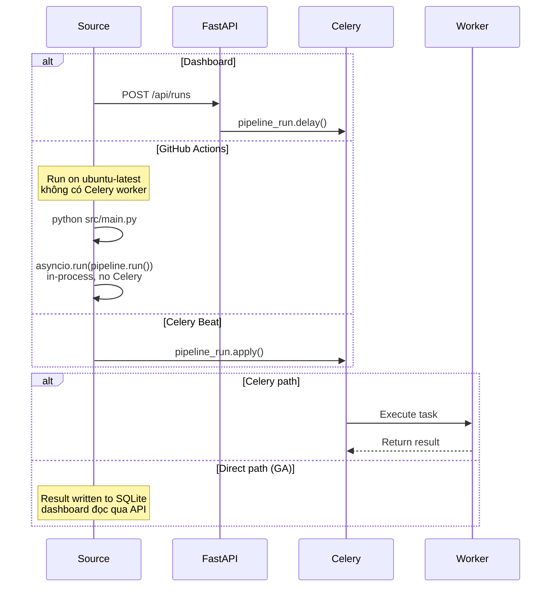

# 02 — Sequence Diagram

> Sequence diagram cho 1 pipeline run. Cập nhật 2026-09-04.

## Happy Path (success)

## Error Path (Scraper fail with retry)

## Error Path (LLM fallback to raw titles)

## Dashboard Polling

## Trigger Sources

## References

- [01-overview.md](01-overview.md) — stages, error handling
- [03-data-model.md](03-data-model.md) — DB schema
- [backend/04-pipeline.md](../backend/04-pipeline.md) — code
