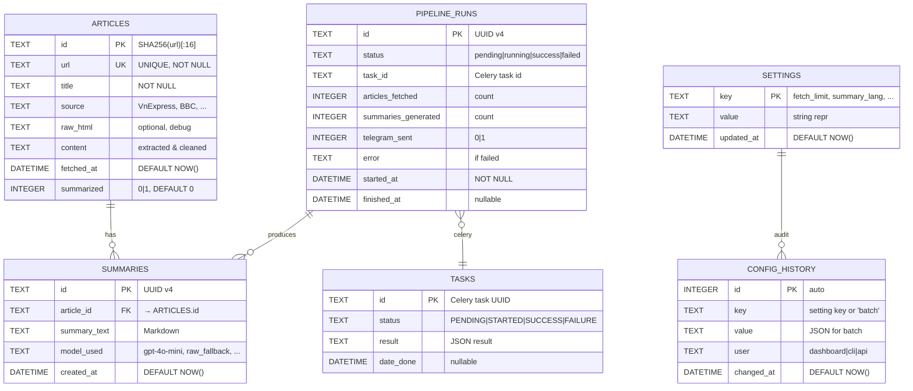

# 03 — Data Model

> ER diagram cho DB schema, tables, relations. Cập nhật 2026-09-04.

## ER Diagram



## Tables

### `articles`

| Field | Type | Constraints | Description |
|-------|------|-------------|-------------|
| `id` | TEXT | PK, NOT NULL | SHA256(url)[:16] — deterministic |
| `url` | TEXT | UNIQUE, NOT NULL | Link gốc bài viết |
| `title` | TEXT | NOT NULL | Tiêu đề |
| `source` | TEXT | | Nguồn tin |
| `raw_html` | TEXT | | HTML gốc (optional) |
| `content` | TEXT | | Nội dung đã extract & clean |
| `fetched_at` | DATETIME | NOT NULL, DEFAULT NOW() | Thời gian fetch |
| `summarized` | INTEGER | NOT NULL, DEFAULT 0 | 0=chưa, 1=đã tóm tắt |

### `summaries`

| Field | Type | Constraints | Description |
|-------|------|-------------|-------------|
| `id` | TEXT | PK, NOT NULL | UUID v4 |
| `article_id` | TEXT | FK→Article.id, NOT NULL | Tham chiếu Article |
| `summary_text` | TEXT | NOT NULL | Nội dung tóm tắt (Markdown) |
| `model_used` | TEXT | NOT NULL | Model LLM |
| `created_at` | DATETIME | NOT NULL, DEFAULT NOW() | Thời gian tạo |

### `pipeline_runs`

| Field | Type | Constraints | Description |
|-------|------|-------------|-------------|
| `id` | TEXT | PK, UUID v4 | Run id |
| `status` | TEXT | NOT NULL | pending\|running\|success\|failed |
| `task_id` | TEXT | | Celery task id |
| `articles_fetched` | INTEGER | | Số articles fetch được |
| `summaries_generated` | INTEGER | | Số summaries tạo |
| `telegram_sent` | INTEGER | | 0/1 |
| `error` | TEXT | | Lỗi nếu failed |
| `started_at` | DATETIME | NOT NULL | Bắt đầu |
| `finished_at` | DATETIME | | Kết thúc |

### `settings` (Stage 3)

| Field | Type | Constraints | Description |
|-------|------|-------------|-------------|
| `key` | TEXT | PK | fetch_limit, summary_lang, ... |
| `value` | TEXT | NOT NULL | string repr |
| `updated_at` | DATETIME | NOT NULL | Last update |

### `config_history` (audit)

| Field | Type | Constraints | Description |
|-------|------|-------------|-------------|
| `id` | INTEGER | PK, auto | auto-increment |
| `key` | TEXT | NOT NULL | setting key hoặc "batch" |
| `value` | TEXT | NOT NULL | JSON nếu batch |
| `user` | TEXT | | dashboard\|cli\|api |
| `changed_at` | DATETIME | NOT NULL | Thời gian đổi |

## Indexes

```sql
-- Articles
CREATE INDEX idx_articles_fetched_at ON articles(fetched_at DESC);
CREATE INDEX idx_articles_summarized ON articles(summarized);

-- Summaries
CREATE INDEX idx_summaries_article_id ON summaries(article_id);

-- Pipeline runs
CREATE INDEX idx_runs_started_at ON pipeline_runs(started_at DESC);

-- Config history
CREATE INDEX idx_config_history_changed_at ON config_history(changed_at DESC);
```

## Data Lifecycle

```
RSS ─fetch─▶ Article ─summarize─▶ Summary ─send─▶ Telegram
              │                       │
              │ 7 days                │ 7 days
              ▼                       ▼
          cleanup_old            cleanup_old
```

| Table | Retention | Cleanup |
|-------|-----------|---------|
| `articles` | `retention_days` (default 7) | `DELETE FROM articles WHERE fetched_at < datetime('now', '-N days')` |
| `summaries` | `retention_days` (default 7) | `DELETE FROM summaries WHERE created_at < datetime('now', '-N days')` |
| `pipeline_runs` | Forever (audit) | Manual hoặc archive after 90 days |
| `config_history` | Forever (audit) | Manual hoặc archive after 1 year |
| `settings` | Forever (current state) | Upsert on update |

## Storage Estimates

| Table | Rows/day | Rows/week | Size (estimate) |
|-------|----------|-----------|-----------------|
| `articles` | 20 (default `fetch_limit`) | 140 | ~50KB total |
| `summaries` | 20 (1:1 với articles) | 140 | ~30KB total |
| `pipeline_runs` | 4 (cron) + manual | ~30/week | ~5KB total |
| `config_history` | ~1 (UI changes) | ~7 | <1KB total |

SQLite file size after 1 month: **~500KB-1MB** (very small).

## References

- [01-overview.md](01-overview.md) — data flow
- [02-sequence.md](02-sequence.md) — sequence diagrams
- [backend/04-pipeline.md](../backend/04-pipeline.md) — code
- [../04-data-config.md](../04-data-config.md) — domain concepts
